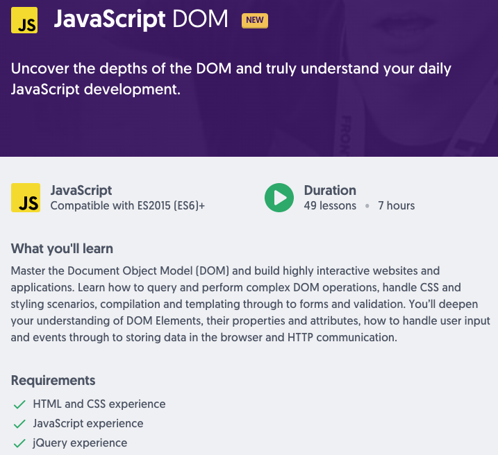
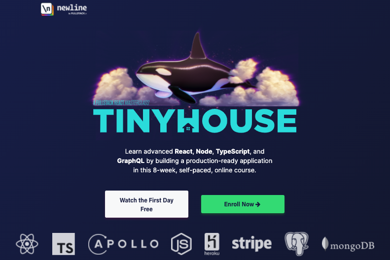

# jerry-fe-learning

💯 🔥 最懂你的大前端学习资料整理

## 初级(大)前端

### 书单

- ⭐️ [《JavaScript权威指南》(犀牛书)](https://item.jd.com/32657989288.html)
- ⭐️ [《JavaScript高级程序设计》(红宝书)](https://item.jd.com/10951037.html)
- ⭐️ [《CSS权威指南》(两条鱼)](https://item.jd.com/46236946774.html)
- ⭐️ [《JAVASCRIPT语言精粹》(蝴蝶书)](https://item.jd.com/1026353943.html)

## 中级(大)前端

### 视频

- [**JavaScript DOM (Ultimate Courses)**](https://ultimatecourses.com/learn/javascript-dom)
  - 都是中级了，不了解 `DOM` 真的说不过去了
  - 如果错过了 `JQuery` 那年代没深入 `DOM`，不妨看看该课程

## 高级(大)前端

- [Tiny House Project (newline)](https://www.newline.co/tinyhouse)
  - 一个全栈的开发实战项目 (两个来自韩国和美国的程序员主导)
  - 涉及了 React, Node, TypeScript, and GraphQL 等技术
