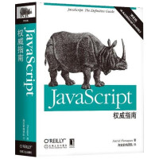
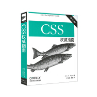
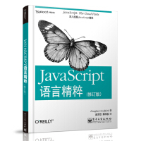
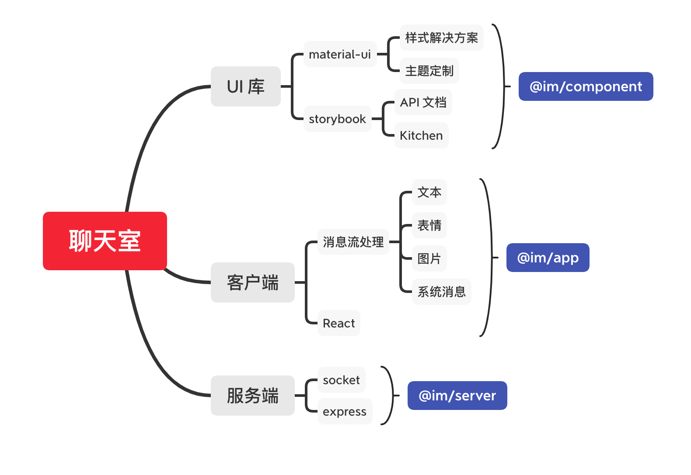
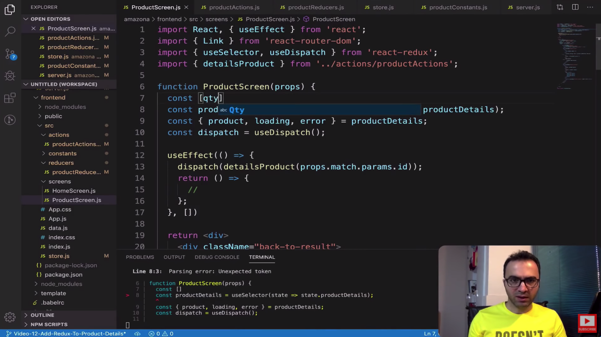
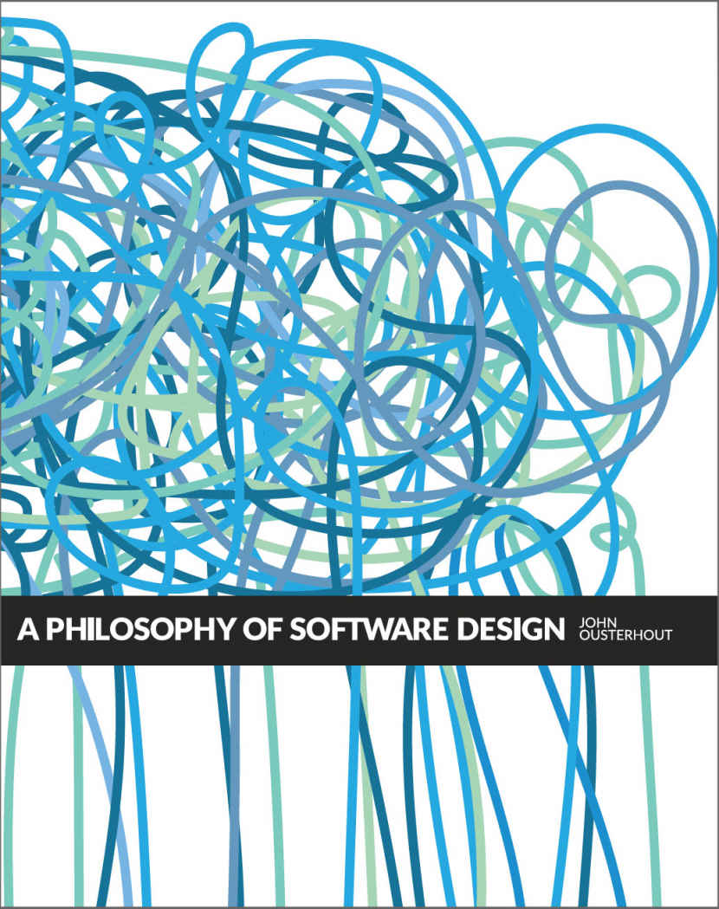
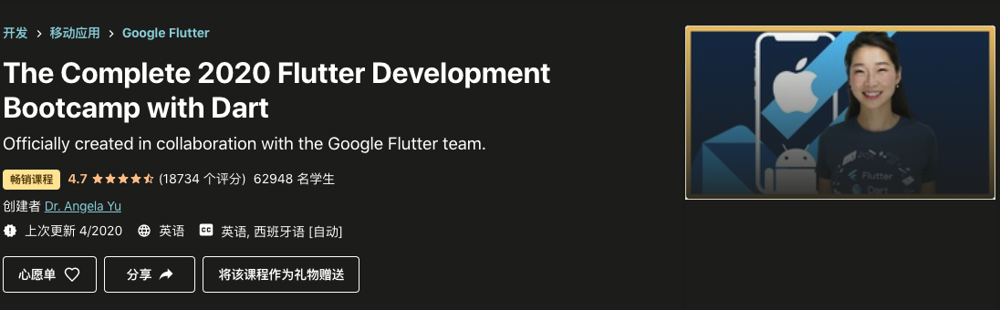

# jerry-fe-learning

💯 🔥 最懂你的大前端学习资料整理

[TOC]

## 初级(大)前端

### 书单

- ⭐️ [《JavaScript权威指南》(犀牛书)](https://item.jd.com/32657989288.html)

- ⭐️ [《JavaScript高级程序设计》(红宝书)](https://item.jd.com/10951037.html)

- ⭐️ [《CSS权威指南》(两条鱼)](https://item.jd.com/46236946774.html)

- ⭐️ [《JAVASCRIPT语言精粹》(蝴蝶书)](https://item.jd.com/1026353943.html)

## 中级(大)前端

### 视频(中级)

- [**JavaScript DOM (Ultimate Courses)**](https://ultimatecourses.com/learn/javascript-dom)
  - 都是中级了，不了解 `DOM` 真的说不过去了
  - 如果错过了 `JQuery` 那年代没深入 `DOM`，不妨看看该课程

### 教程(中级)

- [leer0911/im](leer0911/im)
  - 基于 `React+TS+Socket` 开发的 `IM`，分客户端、服务端、组件库包，采用 `Lerna` 管理。 已实现聊天功能，`Demo` 可运行）

## 高级(大)前端

### 视频(高级)

- [**Tiny House Project (newline)**](https://www.newline.co/tinyhouse)
  - 一个全栈的开发实战项目 (两个来自韩国和美国的程序员主导)
  - 涉及了 React, Node, TypeScript, and GraphQL 等技术

- [React & Node Tutorial - Full ECommerce in 5 Hours [2020]](https://www.youtube.com/watch?v=Fy9SdZLBTOo&feature=youtu.be)
  - 15 年经验老外，5 小时免费带你完成一个全栈项目（React / Node）

### 书单(高级)

- [《软件设计的哲学》中文翻译](https://github.com/gdut-yy/A-Philosophy-of-Software-Design-zh)
- [《深入理解Node.js：核心思想与源码分析》](https://github.com/yjhjstz/deep-into-node)

## 泛前端 - Flutter

- [Google Flutter
The Complete 2020 Flutter Development Bootcamp with Dart](https://www.udemy.com/course/flutter-bootcamp-with-dart/)
  - 伦敦小姐姐讲解的非常非常详细
